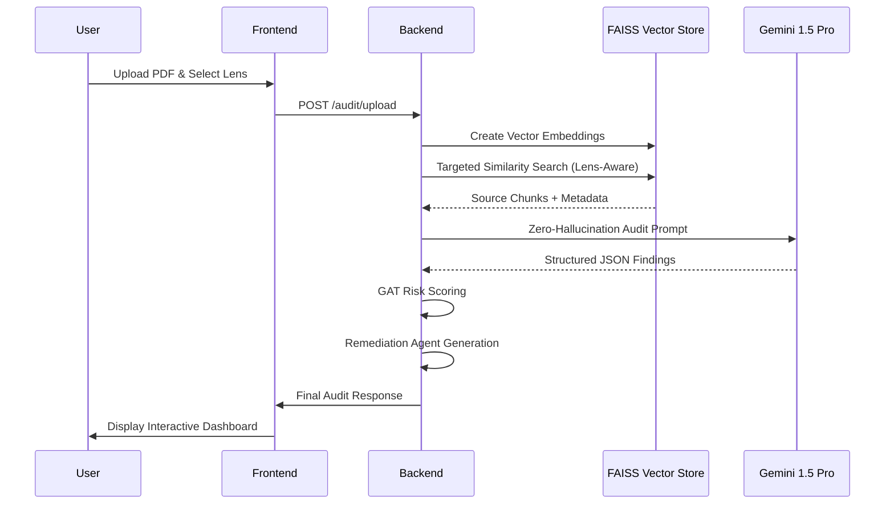

# IncomeLens AI — Technical Architecture

## 1. High-Level Design
IncomeLens AI is built as a highly decoupled, asynchronous enterprise platform. It leverages **FastAPI** for high-performance backend logic and **Next.js 14** for a premium, low-latency frontend experience.

## 2. The Intelligence Pipeline (RAG 2.0)
Our RAG (Retrieval-Augmented Generation) pipeline is designed for **Zero-Hallucination** compliance auditing.

### Step A: Dynamic Lens Ingestion
When an audit is triggered, the system selects the appropriate **AuditLens** (Security, Finance, or Privacy). This reconfigures:
- The vector search queries.
- The system prompt for the auditor agent.
- The scoring weights.

### Step B: 2M Token Context Processing
Leveraging **Gemini 1.5 Pro**, we ingest the entire vendor document into the context window. This removes the "chunking fragmentation" problem common in legacy RAG systems, allowing the AI to see relationships across hundreds of pages.

### Step C: Deterministic Scoring & GAT Modeling
Findings are fed into a deterministic scoring engine. We then apply a **Graph Attention Network (GAT)** inspired relationship risk multiplier.
$$Risk = (RawScore \times GAT\_Multiplier) + Sentiment\_Adj$$

## 3. Data Flow Diagram

## 4. Key Technologies
- **AI Stack:** Google Gemini 1.5 Pro, LangChain, FAISS.
- **Backend:** FastAPI, Async SQLAlchemy, Pydantic v2.
- **Frontend:** Next.js 14, Framer Motion, TailwindCSS, Lucide Icons.
- **DevOps:** Docker, Docker Compose.

---
*Document Version: 1.0.0 — Hackathon Submission Release*
