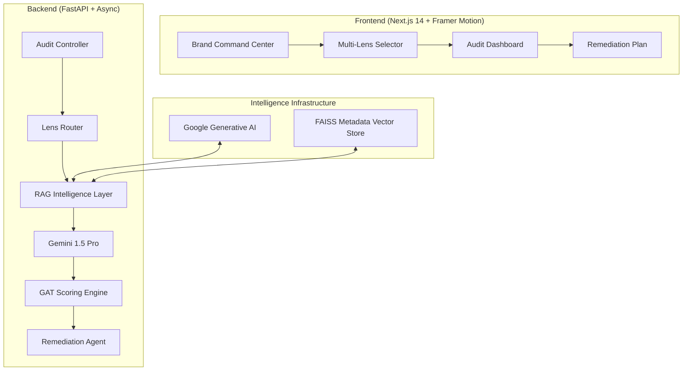

# VantageRisk Hub 🛡️📈 — Enterprise Risk & Intelligence Hub

> **"Turn static compliance documents into dynamic, actionable intelligence with Zero-Hallucination Agentic Workflows."**

VantageRisk Hub is an ultra-premium, multi-domain risk assessment platform built to dominate the **2026 Tech Builder Program** and **Orion Build Challenge**. It extends beyond traditional security auditing into **Financial Integrity** and **Data Privacy**, powered by **Gemini 1.5 Pro's 2M token context** and a custom **GAT-inspired relationship risk engine**.

---

## 🌎 Global Fusion Mission Alignment

VantageRisk Hub is built to bridge the gap between innovation and accountability across the globe. By automating complex risk assessments in **Healthcare, FinTech, and AgriTech**, we enable startups and enterprises to scale safely across borders.

- **Healthcare Impact:** Safeguarding patient data and medical device integrity in underserved regions.
- **AgriTech Impact:** Transparent supply chain auditing to ensure fair trade and sustainability for global farmers.
- **FinTech Impact:** Ensuring financial reporting integrity (IFRS/ASC 606) for international trade.

---

## 🚀 Key Innovations (Why We Win)

### 1. Multi-Domain "Lens" Auditing
Unlike single-purpose tools, VantageRisk Hub features a dynamic prompt factory that reconfigures the agentic workflow for three distinct domains:
- **Security:** SOC2/ISO 27001 compliance (Encryption, MFA, Incident Response).
- **Financial:** IFRS/ASC 606 integrity (Revenue Recognition, Budgetary Controls).
- **Privacy:** GDPR/CCPA sovereignty (Data Residency, Right to Erasure).

### 2. GAT-Inspired Entity Risk Modeling
We implement a sophisticated scoring layer inspired by **Graph Attention Networks (GAT)**. The system doesn't just score a document; it evaluates the vendor's position in a risk graph, factoring in sub-processor vulnerabilities and entity relationship weights.

### 3. Agentic Remediation & Strategic Foresight
VantageRisk Hub doesn't just find problems; it fixes them and forecasts the future.
- **Remediation Agent:** Automatically generates technical fix roadmaps and professional executive communications for every gap.
- **Simulation Engine [NEW]:** A "What-If" modeling tool that allows users to toggle remediation steps and see projected risk score improvements in real-time.

### 4. Multilingual Global Ingestion
Built for the **Global Fusion Hackathon**, our polyglot agentic workflow can audit documents in any language (Spanish, Hindi, French, etc.) while maintaining standardized English-language reporting.

---

## 🏗️ System Architecture



---

## 🔢 The VantageRisk Hub Formula

$$RiskScore = \left( \left( \frac{\text{Passed}}{\text{Total}} \times 100 - \sum \text{Penalties} \right) \times \text{EntityMultiplier} \right) + \text{SentimentAdj}$$

- **EntityMultiplier:** Derived from GAT-inspired relationship graph (0.95x - 1.25x).
- **SentimentAdj:** Predictive adjustment based on market metadata (-5 to +5).

---

## 🏅 Hackathon Track Alignment

- **Artificial Intelligence/ML:** Advanced Agentic RAG with 2M token context and GAT-inspired logic.
- **Financial Technology:** Dedicated lens for IFRS compliance and revenue integrity.
- **Enterprise SaaS:** High-fidelity dashboard, automated remediation, and multi-tenant ready architecture.
- **Cybersecurity:** Zero-hallucination auditing for SOC2/ISO benchmarks.

---

## 🛠️ Quick Start

### 1. Environment Setup
```bash
# .env
GEMINI_API_KEY=your_key_here
DATABASE_URL=sqlite+aiosqlite:///./incomelens.db
```

### 2. Run the Suite
```bash
# Backend
cd backend && uvicorn app.main:app --reload

# Frontend
cd frontend && npm run dev
```

---

**Developed with ❤️ for the 2026 Hackathon Season.**
*Engineered by the VantageRisk Hub Team.*

